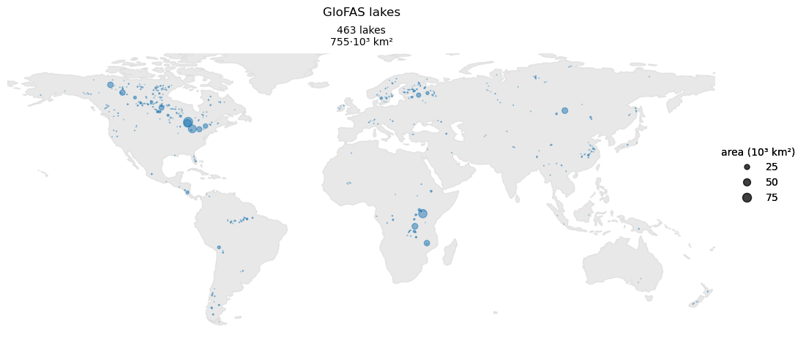
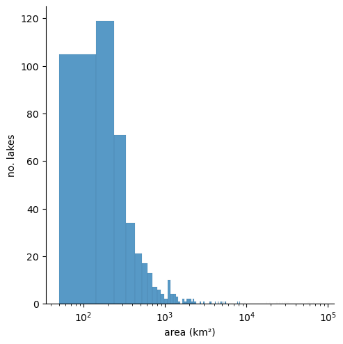
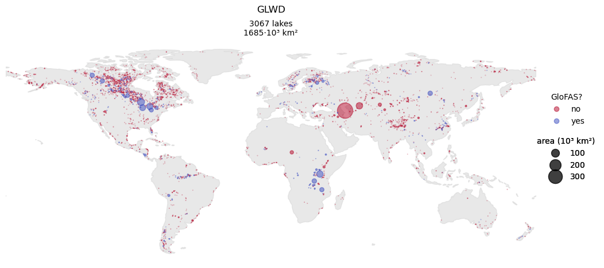
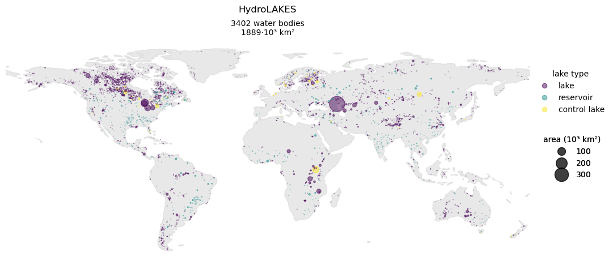
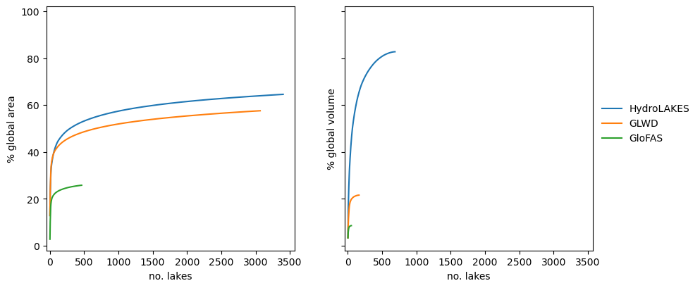
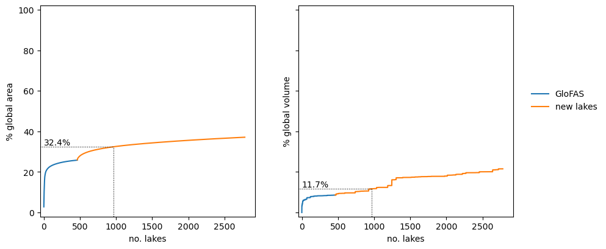
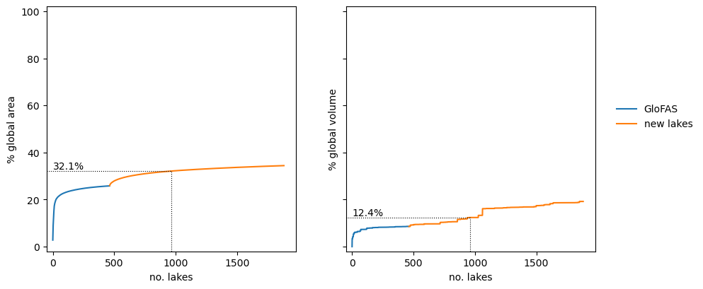

# Selection of lakes
***

**Author:** Chus Casado Rodríguez<br>
**Date:** 11-08-2023<br>

**Introduction:**<br>


**To do:**
* [ ] Filter the `glwd_new` table to reduce the amount of lakes to add in GloFAS.
* [x] Do the previous filter by volume, similarly to the reservoirs.<br>
<font color='steelblue'>To do so, I needed to find a way to connect each GLWD lake with its corresponding lake in HydroLAKES. HydroLAKES includes two volume fields (`Vol_total`, `Vol_res`). Whereas `Vol_res` includes a minority of the lakes/reservoirs, `Vol_total` covers all the reservoirs. Unfortunately, the values in `Vol_total` seem hightly overestimated when compared with GRanD or the few volumne values available in GLWD.</font>
* [x] Is it of any interest to analyse HydroLAKES?<br>
<font color='steelblue'>Yes, since it's the only data set that includes volume.</font>
* [x] Include a filter by reservoir volume (that used in GloFAS) when loading the HydroLAKES points.<br>
<font color='steelblue'>All water bodies in HydroLAKES with area larger than 50 km² have also volume larger than 100 km³.</font>
* [x] Compute total volume from HydroLAKES. `Vol_res` using either all the points or relaxing the area limit of 50 km².


```python
import os
os.environ['USE_PYGEOS'] = '0'
import glob
import pandas as pd
import dask.dataframe as dd
import dask_geopandas as dgpd
import numpy as np
import xarray as xr
import matplotlib.pyplot as plt
%matplotlib inline
import seaborn as sns
import geopandas as gpd
import cartopy.feature as cfeature
import cartopy.crs as ccrs
from tqdm.notebook import tqdm
from shapely.geometry import Point
```


```python
def scientific_format(num):
    if num == 0:
        return '0'
    else:
        exponent = int(np.log10(abs(num)))
        prefix = num / 10**(exponent - 1)
        suffix = '⁰¹²³⁴⁵⁶⁷⁸⁹'[exponent]  # Unicode superscript digits for 0 to 9
        return f"{prefix:.0f}{suffix}"
```


```python
# paths
path_datasets = 'E:/casadje/jrcbox/datasets/'
path_out = '../results/lakes/selection/'
if os.path.exists(path_out) is False:
    os.makedirs(path_out)
```

## GloFAS


```python
# minimum lake surface area included in GloFAS
min_area = 50 # km2

# spatial resolution in GloFAS v4
glofas_pixel = .05 # degrees

# path where the GloFAS data is stored
path_GloFAS = '../data/lakes_wetlands/GloFAS/'
```

#### Raster


```python
glofas_raster = xr.open_dataset(f'{path_GloFAS}20220802_lakes_Global_03min.nc')['lakes']

# remove rows/columns with all NaN
aux = glofas_raster.where(~glofas_raster.isnull(), drop=True)
# extract an array of reservoir ID
ids = np.unique(aux)
ids = ids[~np.isnan(ids)]

# extract coordinates of each reservoir
glofas_coords = pd.DataFrame(index=ids, columns=['lon', 'lat'])
for id in tqdm(glofas_coords.index):
    cell = glofas_raster.where(glofas_raster == id, drop=True)
    glofas_coords.loc[id] = cell.lon.data[0], cell.lat.data[0]
glofas_coords = glofas_coords.round(3)

del aux
```


      0%|          | 0/464 [00:00<?, ?it/s]


#### Metadata


```python
glofas = pd.read_csv(f'{path_GloFAS}GLOFAS_HRES_lakes_metadata.csv')
glofas.set_index('LakID', inplace=True)

# add attributes from the tables used in LISFLOOD
for file in glob.glob(f'{path_GloFAS}*.txt'):
    var = file.split('\\')[-1].split('_')[0][4:]
    try:
        df = pd.read_csv(file, sep='\t', header=None)
        df.dropna(axis=1, how='all', inplace=True)
        df.columns = ['LakID', var]
        df.set_index('LakID', inplace=True, drop=True)
        glofas[var] = df
    except:
        print(file)
        continue
glofas['A'] = glofas.area / 1e6 # convert area to km2
glofas.drop('area', axis=1, inplace=True)
```

#### Comparison


```python
print('no. lakes in the metadata:\t{0}'.format(glofas.shape[0]))
print('no. lakes in the raster:\t{0}'.format(glofas_coords.shape[0]))
print('lakes missing in the metadata:\t{0}'.format(glofas_coords.index.difference(glofas.index).to_list()))
print('lakes missing in the raster:\t{0}'.format(glofas.index.difference(glofas_coords.index).to_list()))
```

    no. lakes in the metadata:	463
    no. lakes in the raster:	464
    lakes missing in the metadata:	[-9999.0]
    lakes missing in the raster:	[]
    


```python
# remove one of the instances of the Therthar lake
glofas_coords.drop(-9999, axis=0, inplace=True)
```


```python
# create geopandas.GeoDataFrame
glofas = gpd.GeoDataFrame(glofas, geometry=[Point(xy) for xy in zip(glofas.LisfloodX3, glofas.LisfloodY3)])
glofas.crs = 'EPSG:4326'
```


```python
# map of GloFAS lakes
fig, ax = plt.subplots(figsize=(20, 5), subplot_kw=dict(projection=ccrs.PlateCarree()))
ax.add_feature(cfeature.NaturalEarthFeature('physical', 'land', '110m', edgecolor='face', facecolor='lightgray'), alpha=.5, zorder=0)
# glofas.plot(markersize=glofas.A * .5e-2, alpha=.5, ax=ax)#, cmap='coolwarm', c=grand_dams.DOR_PC
scatter = ax.scatter(glofas.geometry.x, glofas.geometry.y, s=glofas.A / 1000, alpha=.5)
ax.text(.5, 1.125, 'GloFAS lakes', horizontalalignment='center', verticalalignment='bottom', transform=ax.transAxes, fontsize=12)
text = '{0} lakes\n{1:.0f}·10³ km²'.format(glofas.shape[0], glofas.A.sum() / 1000)
ax.text(.5, 1.02, text, horizontalalignment='center', verticalalignment='bottom', transform=ax.transAxes)
ax.axis('off');

# legend
legend2 = ax.legend(*scatter.legend_elements(prop='sizes', num=4, alpha=.5), title='area (10³ km²)', bbox_to_anchor=[1.025, .3, .1, .4], frameon=False)
ax.add_artist(legend2);

# save
plt.savefig(f'{path_out}glofas_lakes.jpg', dpi=300, bbox_inches='tight')

print('no. lakes in GloFAS:\t\t{0}\t({1} with A > {2} km²)'.format(glofas.shape[0], (glofas.A >= min_area).sum(), min_area))
print('total lake area in GloFAS:\t{0:.0f} km²'.format(glofas.A.sum()))
```

    no. lakes in GloFAS:		463	(463 with A > 50 km²)
    total lake area in GloFAS:	755377 km²
    


    

    


>***Figure 1**. Lakes included in GloFAS. The size of the dots represents the lake area.*


```python
# distribution of the lake area
sns.displot(glofas.A)
plt.xlabel('area (km²)')
plt.ylabel('no. lakes');
plt.xscale('log');

print('Area of the smallest lake:\t{0:.3f} km²'.format(glofas.A.min()))
```

    Area of the smallest lake:	50.000 km²
    


    

    


>***Figure 2**. Lake surface area distribution in GloFAS.*

As explained in [Zajac et al. (2017)](https://www.sciencedirect.com/science/article/pii/S0022169417301671), only lakes with a minimum area of 50 km² are included in GloFAS.

## Global Lakes and Wetlands Database (GLWD)

GLWD ([Lehner et al., 2004](https://www.sciencedirect.com/science/article/pii/S0022169404001404)) is the only source of information about lakes currently included in GloFAS. GLWD includes polygons of the water bodies (either lakes or reservoirs); I will keep only lakes here. It also defines whether a lake is open or closed; I will keep only open lakes, since those are the ones affecting the hydrological simulation downstream the lake.

Field `TYPE`:
* _Lake_
* _Reservoir_

Field `MGLD_TYPE`:
* _open_: lake with significant surface or subsurface outflow.
* _closed_: lake without significant surface or subsurface outflow (inland sink).
* _closedx_: lake probably without significant surface or subsurface outflow (inland sink).
* _res_: reservoir.

I will filter by these 2 fields to keep only open lakes.


```python
# import data set
path_glwd = f'{path_datasets}lakes/GLWD/level1/'
glwd = gpd.read_file(f'{path_glwd}glwd_1.shp')
glwd.set_index('GLWD_ID', drop=True, inplace=True)
glwd.crs = 'EPSG:4326'

# # keep only open lakes
glwd = glwd.loc[(glwd.TYPE == 'Lake')] # & (glwd.MGLD_TYPE == 'open')]

# recompute catchment area in km²
glwd['CATCH_SKM'] = glwd.CATCH_TSKM * 1000
glwd.drop('CATCH_TSKM', axis=1, inplace=True)

# compute a mm equivalent inflow as the quotient between inflow volume and lake area
glwd['INFLOW_MM'] = glwd.INFLOW_CMS / glwd.AREA_SKM * 3600 * 24 * 365 * 1e-6 

# # fill in attributes of Lake Victoria
# glofas.loc[glofas.GLWD_ID.isnull(), ['GLWD_ID', 'CONTINENT']] = [3, 'Africa']
# cols = ['COUNTRY', 'LONG_DEG', 'LAT_DEG']
# glofas.loc[glofas.GLWD_ID.isnull(), cols] = glwd.loc[3, cols]

# add a boolean field whether the lake is already included in GloFAS or not
glwd['GloFAS'] = glwd.index.isin(glofas.GLWD_ID)

# remove empty fields
glwd.dropna(axis=1, how='all', inplace=True)

# convert polygon GeoDataFrame to point GeoDataFrame
glwd = gpd.GeoDataFrame(glwd, geometry=[Point(xy) for xy in zip(glwd.LONG_DEG, glwd.LAT_DEG)])
glwd.crs = 'EPSG:4326'
```

I had to remove the filter by `MGLD_TYPE == 'open'`, otherwise many lakes in GloFAS would be removed from the list of GWLD lakes. 

The source of 462 out of 463 lakes in GloFAS is GLWD. Out of those, 294 are classified as _open_, 26 as _closedx_ and 15 as _closed_ (the remaining 127 are not classified according to `MGLD_TYPE`). <font color='red'>It would be interesting to analyse why the closed lakes were included in GloFAS</font>. Only 1 lake in GloFAS does not have a `GLWD_ID`. It corresponds to lake Wapata (`LakID=460`). The metadata mentions that this lake was added after visual inspection in Google Maps.


```python
fig, ax = plt.subplots(figsize=(20, 5), subplot_kw=dict(projection=ccrs.PlateCarree()))
ax.add_feature(cfeature.NaturalEarthFeature('physical', 'land', '110m', edgecolor='face', facecolor='lightgray'), alpha=.5, zorder=0)
scatter = ax.scatter(glwd.geometry.x, glwd.geometry.y, s=glwd.AREA_SKM / 1000, cmap='coolwarm_r', c=glwd.GloFAS, alpha=.5)
ax.text(.5, 1.125, 'GLWD', horizontalalignment='center', verticalalignment='bottom', transform=ax.transAxes, fontsize=12)
text = '{0} lakes\n{1:.0f}·10³ km²'.format(glwd.shape[0], glwd.AREA_SKM.sum() / 1000)
ax.text(.5, 1.02, text, horizontalalignment='center', verticalalignment='bottom', transform=ax.transAxes)
ax.axis('off');

# legend
handles1, labels1 = scatter.legend_elements(prop='colors', alpha=0.5)
labels1 = ['no', 'yes']
legend1 = ax.legend(handles1, labels1, title='GloFAS?', bbox_to_anchor=[1.005, .55, .1, .25], frameon=False)
ax.add_artist(legend1)
legend2 = ax.legend(*scatter.legend_elements(prop='sizes', num=4, alpha=.5), title='area (10³ km²)', bbox_to_anchor=[1.025, .35, .1, .25], frameon=False)
ax.add_artist(legend2);

plt.savefig(f'{path_out}glwd_lakes.jpg', dpi=300, bbox_inches='tight')

print('no. lakes in GLWD:\t\t\t{0}\t({1} with A > {2} km²)'.format(glwd.shape[0], (glwd.AREA_SKM >= min_area).sum(), min_area))
mask_vol = ~glwd.VOLUME_CKM.isnull()
print('no. lakes in GLWD with volume data:\t{0}\t({1:.1f} km³)'.format(mask_vol.sum(), glwd[mask_vol].VOLUME_CKM.sum()))
print('total lake area in GLWD:\t\t{0:.0f} km²'.format(glwd.AREA_SKM.sum()))
```

    no. lakes in GLWD:			3067	(3061 with A > 50 km²)
    no. lakes in GLWD with volume data:	5	(308.0 km³)
    total lake area in GLWD:		1684639 km²
    


    

    


>***Figure 3**. Lakes in the GLWD data set. The dot size indicates the lake area. Blue dots are lakes included in GloFAS, whereas red dots are excluded from GloFAS.*

The GLWD data set includes 3067 lakes, all but 6 with a lake area larger than 50 km². It means that 2599 lakes in GLWD with area larger than 50 km² were filtered out of GloFAS for other reason (472 classified as _open_, 156 as _closed_ and 124 as _closedx_). 

## Global Reservoir and Dam (GRanD)

GRanD ([Lehner et al., 2011](https://esajournals.onlinelibrary.wiley.com/doi/full/10.1890/100125)) includes both a point shapefile of dams and a polygon shapefile with reservoirs. The amount of reservoirs is slightly smaller than that of dams, but the attributes are the same, so I will use only the dams for the analysis.

I have discovered that GloFAS considers as lakes some reservoirs in GRanD. I will try to list these cases, to exclude them from the list of new reservoirs to be included in GloFAS.


```python
# import data set
path_GRanD = f'{path_datasets}reservoirs/GRanD/v1_3/'
grand = gpd.read_file(f'{path_GRanD}grand_dams_v1_3.shp')
grand.set_index('GRAND_ID', drop=True, inplace=True)
grand = grand.replace(-99, np.nan)

# convert in NaN suspicios values of degree of regulation
grand.DOR_PC = grand.DOR_PC.replace(10000, np.nan)
```


```python
# fill in empty values in the GloFAS metadata using the GRanD data set
glofas['GRAND_ID'] = np.nan
for id in tqdm(glofas.index):
    if np.isnan(glofas.loc[id, 'GRAND_ID']):
        # extract info from GloFAS
        gf_lon, gf_lat = glofas.loc[id, ['LisfloodX3', 'LisfloodY3']]
        
        # compute "distance" from all points in GRanD
        diff = ((grand.LONG_DD - gf_lon)**2 + (grand.LAT_DD - gf_lat)**2)**.5
        if diff.min() <= 5 * glofas_pixel:
            grand_id = diff.idxmin()
            # grand_lake, grand_river = grand.loc[grand_id, ['RES_NAME', 'RIVER']]
            # if (gf_river == grand_river) | (gf_lake == grand_lake):
            #     glofas_.loc[id, ['GRAND_ID', 'LAKE_NAME', 'RIVER']] = grand_id, grand_lake, grand_river
            glofas.loc[id, 'GRAND_ID'] = grand_id
            # attributes = {'LAKE_NAME': 'RES_NAME', 'DAM_NAME': 'DAM_NAME', 'RIVER': 'RIVER'}
            # for gf_attr, grand_attr in attributes.items():
            #     if not isinstance(glofas.loc[id, gf_attr], str):
            #         glofas.loc[id, gf_attr] = grand.loc[grand_id, grand_attr]

print('no. lakes for which a GRanD ID was found:\t{0}'.format(glofas[~glofas.GRAND_ID.isnull()].shape[0]))
```


      0%|          | 0/463 [00:00<?, ?it/s]


    no. lakes for which a GRanD ID was found:	63
    

After individual inspection, 42 of these lakes were found to actually overlap GRanD reservoirs:


```python
# GLWD_ID of lakes overlaping GRanD reservoirs
glwd_id = [3, 8, 13, 15, 29, 38, 109, 130, 195, 261, 268, 340, 380, 393, 455, 555, 559, 613, 617, 707,
           722, 750, 761, 948, 961, 1002, 1064, 1095, 1182, 1204, 1285, 1368, 1423, 1448, 1519, 1537,
           1565, 1670, 1677, 1686, 1714, 2152]
```


```python
grand_id = glofas.loc[glofas.GLWD_ID.isin(glwd_id), 'GRAND_ID'].astype(int).to_list()
```

## HydroLakes

HydroLAKES ([Messager et al., 2016](https://www.nature.com/articles/ncomms13603)) contains more than 1.4 million points of water bodies (both lakes, controlled lakes and reservoirs). 

Interesting fields:

* `Lake_type` indicates the type of water body:
    * 1: lake.
    * 2: reservoir.
    * 3: lake control
* `Lake_area`: surface area in km².
* `Vol_total`: total lake/reservoir volume in hm³.
* `Vol_res`: reported reservoir volume, or storage volume of added lake regulation (hm³)
* `Vol_src`: source of volume data:
    * 1: ‘Vol_total’ is the reported total lake volume from literature
    * 2: ‘Vol_total’ is the reported total reservoir volume from GRanD or literature
    * 3: ‘Vol_total’ is the estimated total lake volume using the geostatistical modeling approach by Messager et al. (2016)
* `Depth_avg`: average depth in m.
* `Dis_avg`: average long-term discharge (m3).
* `Res_time`: average residence time in days.
* `Wshd_area`: area of the lake's watershed in km2.
* `Pour_long` and `Pour_lat` are the coordinates of the pour point in decimal degrees.
* `dis_m3_pyr`: annual average natural discharge.


```python
# input and output directories for HydroLAKES
path_atlas_in = f'{path_datasets}lakes/HydroLAKES/LakeATLAS_v10_shp/'
path_atlas_out = '../data/lakes_wetlands/LakeATLAS/'

# columns to be used from HydroATLAS
cols = ['Hylak_id', 'Lake_name', 'Country', 'Continent', 'Poly_src', 'Lake_type', 'Grand_id', 'Lake_area',
        'Shore_len', 'Shore_dev', 'Vol_total', 'Vol_res', 'Vol_src', 'Depth_avg', 'Dis_avg',
        'Res_time', 'Elevation', 'Slope_100', 'Wshd_area', 'Pour_long', 'Pour_lat', 'dis_m3_pyr']
```

**Global lake area and lake volume**

As a reference for comparison, I will compute the total area and total volume of all lakes in HydroLAKES (both natural and controlled). Since HydroLAKES is the data set with the largest amount of water bodies, these would be considered as the most representative global values.


```python
if 'totals' in locals():
    del totals
for file in tqdm(glob.glob(f'{path_atlas_in}*_v10_pnt_*.shp')):
    # load HydroLAKES
    ddf = dgpd.read_file(file, columns=cols, npartitions=10)
    # remove reservoirs and small lakes
    mask_lakes = ddf.Lake_type.isin([1, 3])
    # compute and convert into geopandas
    totals_i = ddf[['Lake_area', 'Vol_total', 'Vol_res']].sum(axis=0).compute()
    if 'totals' in locals():
        totals = pd.concat([totals, totals_i], axis=1).sum(axis=1)
    else:
        totals = totals_i
    del ddf, mask_lakes, totals_i
    
# convert volume data into km³
totals[['Vol_res', 'Vol_total']] /= 1e3

print('All lakes (natural and controlled) in HydroLAKES have the following totals:')
print('area:\t\t{0:.1f} km²\nvolumen_1:\t{1:.1f} km³ (Vol_total)\nvolumen_2\t{2:.1f} km³ (Vol_res)'.format(*totals))
```


      0%|          | 0/2 [00:00<?, ?it/s]


    All lakes (natural and controlled) in HydroLAKES have the following totals:
    area:		2926722.6 km²
    volumen_1:	187866.1 km³ (Vol_total)
    volumen_2	5991.2 km³ (Vol_res)
    

The two volume fields (`Vol_total` , `Vol_res`) render very different values of volume. As we will see later on, `Vol_total` is provided for all entries in the data set, whereas `Vol_res` is only provided for a minority of entries. When compared against GRanD or GLWD, the values in `Vol_res` seem more reliable, whereas those in `Vol_total` seem to overestimate the volume.

So far, we can only compare the area totals from GloFAS and GLWD with HydroLAKES. **GloFAS includes 755·10³ km³ (28% of HydroLAKES)** and **GLWD represents 1,685·10³ km³ (63%)**.

**Load and filter HydroLAKES**

I will load the complete set of water bodies in HydroLAKES (over 1.4 million) and filter by two conditions:
* `Lake_area` larger or equal than 50 km² established in GloFAS.
* `Lake_type`. Originally I kept only natural lakes (1), but after identifying several items in GLWD and GloFAS as reservoirs (2) or controlled lakes (2), I removed this condition.


```python
# file with the selection of HydroLAKES
atlas_file = f'{path_atlas_out}LakeATLAS_v10_pnt_filter.shp'

if os.path.exists(atlas_file):
    atlas = gpd.read_file(atlas_file)
    atlas.set_index('Hylak_id', drop=True, inplace=True)

else:
    if 'atlas' in locals():
        del atlas
    for file in tqdm(glob.glob(f'{path_atlas_in}*_v10_pnt_*.shp')):
        # load HydroLAKES
        ddf = dgpd.read_file(f'{path_atlas_in}{file}', columns=cols, npartitions=10)
        # remove reservoirs and small lakes
        mask_lakes = ddf.Lake_type.isin([1, 2, 3]) #([1, 3])
        mask_area = ddf.Lake_area >= min_area
        ddf = ddf.loc[mask_lakes & mask_area]
        # compute and convert into geopandas
        df = ddf.compute()
        if 'atlas' not in locals():
            atlas = df
        else:
            atlas = pd.concat([atlas, df])
        del ddf, mask_lakes, mask_area, df
    atlas = gpd.GeoDataFrame(atlas, geometry=[Point(xy) for xy in zip(atlas.Pour_long, atlas.Pour_lat)])
    atlas.set_index('Hylak_id', drop=True, inplace=True)

    # exportar
    atlas.to_file(atlas_file, driver='ESRI Shapefile', crs='EPSG:4326')

# convert 0 volumes to NaN
atlas.Vol_res.replace(0, np.nan, inplace=True)
# convert volume values to km³
atlas[['Vol_res', 'Vol_total']] /= 1e3
```


```python
r = 1000

fig, ax = plt.subplots(figsize=(20, 5), subplot_kw=dict(projection=ccrs.PlateCarree()))
ax.add_feature(cfeature.NaturalEarthFeature('physical', 'land', '110m', edgecolor='face', facecolor='lightgray'), alpha=.5, zorder=0)
scatter = plt.scatter(atlas.geometry.x, atlas.geometry.y, s=atlas.Lake_area / r,
                      alpha=.5, cmap='viridis', c=atlas.Lake_type)
ax.text(.5, 1.125, 'HydroLAKES', horizontalalignment='center', verticalalignment='bottom',
        transform=ax.transAxes, fontsize=12)
text = '{0} water bodies\n{1:.0f}·{2} km²'.format(atlas.shape[0], atlas.Lake_area.sum() / r, scientific_format(r))
ax.text(.5, 1.02, text, horizontalalignment='center', verticalalignment='bottom', transform=ax.transAxes)
ax.axis('off');

# legend
handles1, labels1 = scatter.legend_elements(prop='colors', alpha=0.5)
labels1 = ['lake', 'reservoir', 'control lake']
legend1 = ax.legend(handles1, labels1, title='lake type', bbox_to_anchor=[1.0, .65, .08, .25], frameon=False)
ax.add_artist(legend1)
legend2 = ax.legend(*scatter.legend_elements(prop='sizes', num=4, alpha=.5), title='area ({0} km²)'.format(scientific_format(r)),
                    bbox_to_anchor=[1.05, .35, .1, .25], frameon=False)
ax.add_artist(legend2);

print('no. lakes:\t\t{0}'.format(atlas.shape[0]))
print('total lake area:\t{0:.0f} km²\t({1:.0f}% total)'.format(atlas.Lake_area.sum(), atlas.Lake_area.sum() / totals.Lake_area * 100))
print('total lake volume:\t{0:.0f} km³\t({1:.0f}% total) -> Vol_total'.format(atlas.Vol_total.sum(), atlas.Vol_total.sum() / totals.Vol_total * 100))
print('total lake volume:\t{0:.0f} km³\t({1:.0f}% total) -> Vol_res'.format(atlas.Vol_res.sum(), atlas.Vol_res.sum() / totals.Vol_res * 100))
```

    no. lakes:		3402
    total lake area:	1889475 km²	(65% total)
    total lake volume:	180599 km³	(96% total) -> Vol_total
    total lake volume:	4956 km³	(83% total) -> Vol_res
    


    

    


>***Figure 4**. Water bodies in the HydroLAKES data set with surface area exceeding 50 km². The dot size indicates the lake area, and the dot colour the type of water body.*

Filtering the HydroLAKES by a minimum area reduces the number of items from 1.4 million to only 3402. This drastic reduction represents, however, 65% of the global lake area and approximately 90% of the volume.

**Analysis of volume data in HydroLAKES**

The HydroLakes data set contains three fields with volume data:

* *Vol_total*: Total lake or reservoir volume, in million cubic meters (1 mcm = 0.001 km3). For most polygons, this value represents the total lake volume as estimated using the geostatistical modeling approach by Messager et al. (2016). However, where either a reported lake volume (for lakes ≥ 500 km2) or a reported reservoir volume (from GRanD database) existed, the total volume represents this reported value. In cases of regulated lakes, the total volume represents the larger value between reported reservoir and modeled or reported lake volume. Column ‘Vol_src’ provides additional information regarding these distinctions.
* *Vol_res*: Reported reservoir volume, or storage volume of added lake regulation, in million cubic meters (1 mcm = 0.001 km3). 0: no reservoir volume
* *Vol_src*:
    * 1: ‘Vol_total’ is the reported total lake volume from literature
    * 2: ‘Vol_total’ is the reported total reservoir volume from GRanD or literature
    * 3: ‘Vol_total’ is the estimated total lake volume using the geostatistical modeling approach by Messager et al. (2016)

In the following cell I will analyse the volume data contained in columns `Vol_total` and `Vol_res` to identify which one of the two sources is more reliable.


```python
mask_voltotal = ~atlas.Vol_total.isnull()
print('{0:>4} out of {1} water bodies in HydroLakes include the "Vol_total" value:\t{2:.1f} km³'.format(mask_voltotal.sum(), atlas.shape[0], atlas[mask_voltotal].Vol_total.sum() * 1e-3))

mask_volres = ~atlas.Vol_res.isnull()
print('{0:>4} out of {1} water bodies in HydroLakes include the "Vol_res" value:\t{2:.1f} km³ ({3:.1f} km³ in "Vol_total")'.format(mask_volres.sum(), atlas.shape[0], atlas[mask_volres].Vol_res.sum() * 1e-3, atlas[mask_volres].Vol_total.sum() * 1e-3))
```

    3402 out of 3402 water bodies in HydroLakes include the "Vol_total" value:	180599.0 km³
     687 out of 3402 water bodies in HydroLakes include the "Vol_res" value:	4955.6 km³ (34345.8 km³ in "Vol_total")
    

**The volume estimates in the columns `Vol_total` and `Vol_res` differ notably (in the order of 7 times more in `Vol_total`)**. Less than 1 in 5 water bodies contain data in the `Vol_res` column, which seems to be the most consistent field compared with the data in GRanD and GLWD.


```python
# source of water bodies whose volume match
atlas[np.isclose(atlas.Vol_total, atlas.Vol_res, atol=10, rtol=1e-2)].Vol_src.value_counts()
```


    2    630
    1      3
    Name: Vol_src, dtype: int64


633 water bodies have colse values of volume in the *Vol_total* and *Vol_res*. All but 3 take the value from GRAND.

## Compare data sets

### Connect HydroLAKES with GLWD

The added value of HydroLAKES is the fact that is the only data set that includes lake volume. If we want to use the lake volume as the target variable in the selection of lakes to be added in GloFAS, we need to find a way to connect HydroLAKES with GLWD and Glofas.

* GloFAS includes the fields `LakID` and `GLWD_ID`. `LakID` is the code identifying each lake in GloFAS. `GLWD_ID` is the GLWD identification of those lakes; all but one lake in GloFAS has a `GLWD_ID` assigned to it.
* GLWD includes only its own identification (`GLWD_ID`).
* HydroLAKES includes its own identificaion (`Hylak_id`) and that of the data set GRanD (`Grand_id`). However, `Grand_id` takes the value 0 ofr most of the water bodies, since lakes are not included in GRanD. 

We need to find the `Hylak_id` of the lakes in GLWD in order to add the lake volume attribute. Since the connection between GLWD and GloFAS is already set, the transfer of volume data to the GloFAS lakes is direct.

At this point I did some processing in QGIS to intersect the polygons in the GLWD data set and those selected from HydroLakes with the objective of identifying the *Hylak_id* of every GWLD lake:

In QGIS:
1. Import the point layer created above with the selection of lakes in HydroLakes.
2. Extract from the orignal polygon layers in HydroLAKES the polygons corresponding to the selected points in step 1 (`select by location`).
3. Correct the geometry to remove rings and overlapping points. The conflicting points were found with the QGIS function `check validity`.
4. Intersect the corrected HydroLAKES polygon layer with the GLWD polygon layer.
5. Calculate the area (km²) of the intersected polygons in a new field named *area_int*.

The resulting polygon layer contains the fields *GLWD_ID* and *Hylak_id* which will be used in the following cells to map the GLWD lakes with those in HydroLAKES. The connection betweem these two data sets is not uniquivocal: a `GLWD_ID` may have several `Hylak_id` intersecting it, and viceversa. As we want to transfer data from HydroLAKES to GLWD, the `mapping` dictionary will map each `GLWD_ID` to one or more `Hylak_id`, and not the other way around.


```python
# load the polygon layer of the intersection between HydroLakes and GLWD
atlas_glwd = gpd.read_file(f'{path_atlas_out}LakeATLAS_GLWD_intersection.shp')
atlas_glwd = atlas_glwd[['Hylak_id', 'GLWD_ID', 'area_int', 'geometry']]
atlas_glwd.set_index('GLWD_ID', drop=False, inplace=True)

print('{0} intersected polygons'.format(atlas_glwd.shape[0]))
```

    3004 intersected polygons
    


```python
# map 
mapping = {}
for glwd_id in tqdm(atlas_glwd.GLWD_ID.unique()):
    aux = atlas_glwd.loc[glwd_id, 'Hylak_id']
    try:
        mapping[glwd_id] = aux.unique()
    except:
        mapping[glwd_id] = [aux]
        
# add manually relationships found manually
mapping.update({#1448: [9794],
               # 1315: [15725, 15723],
               # 1650: [178783, 178782, 15717, 178779, 1393930],
               333: [5101],
               # 2801: [5325]
                })
```


      0%|          | 0/2824 [00:00<?, ?it/s]


### Transfer data from HydroLAKES to GLWD (and GloFAS)

For every GLWD lake I will add not only the sum of the volumes from HydroLAKES (`Vol_total`, `Vol_res`), but also the most common source of the volume data (`Vol_src`) and the most common lake type (`Lake_type`).


```python
# add volume to the GLWD lakes
cols = ['Vol_total', 'Vol_res', 'Vol_src', 'Lake_type']
glwd[cols] = np.nan
for id in tqdm(glwd.index):
    if id in mapping:
        glwd.loc[id, ['Vol_total', 'Vol_res']] = round(atlas.loc[mapping[id], ['Vol_total', 'Vol_res']].sum(), 1)
        glwd.loc[id, ['Vol_src']] = atlas.loc[mapping[id], 'Vol_src'].value_counts().idxmax()
        glwd.loc[id, ['Lake_type']] = atlas.loc[mapping[id], 'Lake_type'].value_counts().idxmax()

glwd.Vol_res.replace(0, np.nan, inplace=True)
mask_vol = ~glwd.Vol_res.isnull()
print('lake volume was found for {0} out of {1} lakes in GLWD:\t{2:.1f} km³\t({3:.1f}% total)'.format(mask_vol.sum(),
                                                                                                      glwd.shape[0],
                                                                                                      glwd[mask_vol].Vol_res.sum(),
                                                                                                      glwd[mask_vol].Vol_res.sum() / totals.Vol_res * 100))
print('\nCounts of lake types:')
print(glwd.Lake_type.value_counts())
```


      0%|          | 0/3067 [00:00<?, ?it/s]


    lake volume was found for 162 out of 3067 lakes in GLWD:	1294.3 km³	(21.6% total)
    
    Counts of lake types:
    1.0    2227
    2.0     119
    3.0      38
    Name: Lake_type, dtype: int64
    

**Only 162 lakes in GLWD have been filled with volume values**, representing 21.6% of the global lake volume. The majority of lakes in GLWD are classified in HydroLAKES either as natural (2227) or controlled lakes (38), but **119 are considered to be reservoirs**.


```python
glwd.loc[~glwd.VOLUME_CKM.isnull(), ['LAKE_NAME', 'VOLUME_CKM', 'Vol_total', 'Vol_res', 'Vol_src']]
```


<div>
<style scoped>
    .dataframe tbody tr th:only-of-type {
        vertical-align: middle;
    }

    .dataframe tbody tr th {
        vertical-align: top;
    }

    .dataframe thead th {
        text-align: right;
    }
</style>
<table border="1" class="dataframe">
  <thead>
    <tr style="text-align: right;">
      <th></th>
      <th>LAKE_NAME</th>
      <th>VOLUME_CKM</th>
      <th>Vol_total</th>
      <th>Vol_res</th>
      <th>Vol_src</th>
    </tr>
    <tr>
      <th>GLWD_ID</th>
      <th></th>
      <th></th>
      <th></th>
      <th></th>
      <th></th>
    </tr>
  </thead>
  <tbody>
    <tr>
      <th>3</th>
      <td>Lake Victoria</td>
      <td>204.80</td>
      <td>2760.0</td>
      <td>204.8</td>
      <td>1.0</td>
    </tr>
    <tr>
      <th>8</th>
      <td>Baikal</td>
      <td>46.00</td>
      <td>23615.1</td>
      <td>46.0</td>
      <td>1.0</td>
    </tr>
    <tr>
      <th>15</th>
      <td>Lake Ontario</td>
      <td>29.96</td>
      <td>1640.0</td>
      <td>30.0</td>
      <td>1.0</td>
    </tr>
    <tr>
      <th>28</th>
      <td>Reindeer</td>
      <td>14.86</td>
      <td>92.4</td>
      <td>14.9</td>
      <td>1.0</td>
    </tr>
    <tr>
      <th>38</th>
      <td>Nipigon</td>
      <td>12.36</td>
      <td>247.8</td>
      <td>12.4</td>
      <td>1.0</td>
    </tr>
  </tbody>
</table>
</div>


The table above compares the volume in the GLWD and HydroLAKES data sets for the 5 lakes for which volume is reported in both sources. The column `VOLUME_CKM` belongs to GLWD and the columns `Vol_total`, `Vol_res` and `Vols_src` to HydroLAKES. The column `Vol_total` reports a volume much higher than the other columns. Instead, `VOLUME_CKM` and `Vol_res` have similar values. For that reason, I will fill in the volume column in GloFAS with the data fom `Vol_res`.


```python
volume_col = 'Vol_res' # 'Vol_total'

# fill in a volume field in the glofas data set
idx = glofas.index.intersection(glofas.GLWD_ID)
for col in [volume_col, 'Lake_type']:
    glofas[col] = [glwd.loc[id, col] if id in glwd.index else np.nan for id in glofas.GLWD_ID]
    
mask_vol = ~glofas[volume_col].isnull()
print('lake volume was found for {0} out of {1} lakes in GloFAS:\t{2:.1f} km³\t({3:.1f}% total)'.format(mask_vol.sum(),
                                                                                                        glofas.shape[0],
                                                                                                        glofas[mask_vol][volume_col].sum(),
                                                                                                        glofas[mask_vol][volume_col].sum() / totals[volume_col] * 100))
print()
print(glofas.Lake_type.value_counts())
```

    lake volume was found for 50 out of 463 lakes in GloFAS:	515.0 km³	(8.6% total)
    
    1.0    395
    3.0     27
    2.0     21
    Name: Lake_type, dtype: int64
    

We could find the lake volume for only 50 of the lakes currently in GloFAS, representing only 8.6% of the global lake volume. We could also extract from HydroLAKES the lake type; **27 of the lakes in GloFAS are considered as controlled lakes and 21 as reservoirs**.

### Select lakes


```python
summary = {'HydroLAKES': pd.DataFrame(pd.concat((atlas.Lake_area, atlas[volume_col], atlas.Lake_type), axis=1)).rename(columns={'Lake_area': 'area_skm',
                                                                                                                                   volume_col: 'volume_ckm',
                                                                                                                                   'Lake_type': 'lake_type'}),
           'GLWD': glwd[['AREA_SKM', volume_col, 'Lake_type']].rename(columns={'AREA_SKM': 'area_skm',
                                                                              volume_col: 'volume_ckm',
                                                                              'Lake_type': 'lake_type'}),
           'GloFAS': glofas[['A', volume_col, 'Lake_type']].rename(columns={'A': 'area_skm',
                                                                              volume_col: 'volume_ckm',
                                                                              'Lake_type': 'lake_type'})
          }

totals_ = totals.rename(index={'Lake_area': 'area_skm', volume_col: 'volume_ckm'})
```


```python
types = None #[1, 3]

fig, axes = plt.subplots(ncols=2, figsize=(10, 4.5), sharex=True, sharey=True)

for ax, col in zip(axes, ['area_skm', 'volume_ckm']):
    for key, df in summary.items():
        if types is not None:
            df_ = df[df.lake_type.isin(types)].copy()
        else:
            df_ = df.copy()
        df_.sort_values(col, ascending=False, inplace=True)
        ax.plot(np.arange(1, df_.shape[0] + 1), df_[col].cumsum() / totals_[col] * 100, label=key)
                
    ax.set(xlabel='no. lakes', ylabel= '% global ' + col.split('_')[0], xlim=(-50, None), ylim=(-2, 102))
    
fig.legend(*ax.get_legend_handles_labels(), frameon=False, bbox_to_anchor=[.9, .4, .15, .2]);
```


    

    


> ***Figure 5**. Percentages of global lake area and global lake volume represented by the three data sets HydroLAKES, GLOWD and GloFAS. The lakes in each data set are sorted from largest to smallest to show the number of lakes needed to reach a given percentage.*

From the previous figure we can extract the following ideas:

* The majority of lakes in all data sets miss the volume. This is a big issues that limits the possibility of selecting lakes using its volume as the filter.
* It seems that the volume data is able to represent a larger proportion of the global total (at least for HydroLAKES). It can be an artifact cause by the fact that many lakes in HydroLAKES do not have a `Vol_res` value; the proportion of lakes missing this value could be larger in the complete set of lakes (the reference to compute global lake volume) than in those with area larger than 50 km² (those used to plot the blue line).
* The differences between HydroLAKES and GLWD are small in terms of lake area, both number of lakes and percentage of global area. Instead, the differences in lake volume are large.
* GloFAS represents approximately 44% of the area in GLWD and 40% of the volume even though it includes only 15% of the lakes in GLWD. The shape of the curves show that GLWD lakes with large area/volume were not included in GloFAS; this must be analysed. A possible explanation is that the GLWD data here shown includes some close (or probably close) lakes, which are of no interest in GloFAS.

The conclusion is that the best source to add lakes to GloFAS is again GLWD. HydroLAKES is a larger data set, but when looking at water bodies with a minimum surface area of 50 km² is reduced to a subset very similar to GLWD. The added value of HydroLAKES was the lake volume data, but we have discovered that is not reliable and does not cover the majority of the lakes, so the selection of new lakes to be added to GloFAS will be based in surface area.

**GLWD lakes to be added to GloFAS**

For the inclusion in GloFAS I will keep only those classified as _open_ or unknown.


```python
# select GWLD lakes to be added in GloFAS
mask_area = glwd.AREA_SKM >= min_area
mask_glofas = ~glwd.GloFAS
mask_type = glwd.MGLD_TYPE.isin(['open', None])

new_lakes = glwd[mask_area & mask_glofas & mask_type].copy()
```


```python
r = 1000

fig, ax = plt.subplots(figsize=(20, 5), subplot_kw=dict(projection=ccrs.PlateCarree()))
ax.add_feature(cfeature.NaturalEarthFeature('physical', 'land', '110m', edgecolor='face', facecolor='lightgray'), alpha=.5, zorder=0)
scatter = plt.scatter(new_lakes.geometry.x, new_lakes.geometry.y, s=new_lakes.AREA_SKM / r,
                      alpha=.5)#, cmap='coolwarm', c=new_lakes.MGLD_TYPE.map({'open': 1, None: 2, 'closedx': 3, 'closed': 4}))
ax.text(.5, 1.125, 'GLWD - not in GloFAS', horizontalalignment='center', verticalalignment='bottom',
        transform=ax.transAxes, fontsize=12)
text = '{0} lakes\n{1:.0f}·{2} km²'.format(new_lakes.shape[0], new_lakes.AREA_SKM.sum() / r, scientific_format(r))
ax.text(.5, 1.02, text, horizontalalignment='center', verticalalignment='bottom', transform=ax.transAxes)
ax.axis('off');

# legend
# handles1, labels1 = scatter.legend_elements(prop='colors', alpha=0.5)
# labels1 = ['open', 'unknown', 'closed?', 'closed']
# legend1 = ax.legend(handles1, labels1, title='lake type', bbox_to_anchor=[1.0, .65, .08, .25], frameon=False)
# ax.add_artist(legend1)
legend2 = ax.legend(*scatter.legend_elements(prop='sizes', num=4, alpha=.5), title='area ({0} km²)'.format(scientific_format(r)),
                    bbox_to_anchor=[1.025, .35, .1, .25], frameon=False)
ax.add_artist(legend2);

print('no. lakes:\t\t\t{0}\t'.format(new_lakes.shape[0]))
mask_vol = ~new_lakes[volume_col].isnull()
print('no. lakes with volume data:\t{0}\t({1:.1f} km³)'.format(mask_vol.sum(), new_lakes[mask_vol][volume_col].sum()))
print('total lake area:\t\t{0:.0f} km²'.format(new_lakes.AREA_SKM.sum()))
```

    no. lakes:			2319	
    no. lakes with volume data:	107	(774.6 km³)
    total lake area:		330899 km²
    


    

    


> ***Figure 6**. GLWD lakes not included in GloFAS.*

There are 2319 lakes in GLWD classified as open or unknown that are missing in GloFAS. They concentrate in very high latitudes, both North (Canada and Scandinavia) and South (Patagonia), and in the Himalayas. Adding all these resevoirs would increase the lake surface area in GloFAS by 43 %. Since adding this large number of lakes is not feasible, we need to filter the most important among these lakes. The importance will be based on the lake surface area.

**Catchment area**


```python
# sort new lakes by descending area and rename columns
new_lakes.sort_values('AREA_SKM', ascending=False, inplace=True)
new_lakes.rename(columns={'AREA_SKM': 'area_skm', 'Vol_res': 'volume_ckm'}, inplace=True)

# export selected GWLD
new_lakes.to_file(f'{path_out}GLWD_selection.shp')
```


```python
# import GLWD polygons
glwd_polygon = gpd.read_file(f'{path_glwd}glwd_1.shp')
glwd_polygon.set_index('GLWD_ID', drop=True, inplace=True)
glwd_polygon.crs = 4326

# filter the selected polygons
glwd_polygon = glwd_polygon.loc[new_lakes.index, :]

# export
glwd_polygon.to_file('../data/lakes_wetlands/GLWD/glwd_1_selection.shp', driver='ESRI Shapefile', index=True)
```

I've exported the `new_lakes` both as a point layer and as a polygon shapefile and I will process it in QGIS to remove lakes that do not overlap rivers in GloFAS.

In QGIS:

1. Create a polyline layer of GloFAS rivers:
    * Convert the `upArea` map in boolean map where upstream area is larger or equal than 1000 km².
    * Convert the boolean map into a polyine (functions `r.thin` and `r.to.vect`).
2. In the polygon layer add a field `on_river` indicating whether the polygon overlaps a GloFAS river (1) or no(0). 


```python
# import the polygon layer treated in QGIS
new_lakes_pol = gpd.read_file('../data/lakes_wetlands/GLWD/glwd_1_selection.shp')
new_lakes_pol.set_index('GLWD_ID', drop=True, inplace=True)

# join the 'on_river' field to 'new_lakes'
new_lakes['on_river'] = 0 #new_lakes_pol['on_river'
new_lakes.loc[new_lakes_pol.index, 'on_river'] = new_lakes_pol.on_river

# del new_lakes_pol

new_lakes.on_river.value_counts()
```


    1    1419
    0     900
    Name: on_river, dtype: int64


Out of the 2319 new lakes, 1419 lay over a GloFAS river.


```python
n_lakes = 500

fig, axes = plt.subplots(ncols=2, figsize=(10, 4.5), sharey=True)

glofas_ = summary['GloFAS'].sort_values('area_skm', ascending=False)

for ax, col in zip(axes, ['area_skm', 'volume_ckm']):
    glofas_cumsum = glofas_[col].replace(np.nan, 0).cumsum()
    ax.plot(np.arange(glofas_cumsum.shape[0]), glofas_cumsum / totals_[col] * 100, label='GloFAS')
    
    new_cumsum = glofas_[col].sum() + new_lakes[col].replace(np.nan, 0).cumsum()
    ax.plot(np.arange(glofas_.shape[0], glofas_.shape[0] + new_lakes.shape[0]), new_cumsum / totals_[col] * 100, label='new lakes')
    
    perc = new_cumsum.iloc[n_lakes] / totals_[col] * 100
    ax.vlines(glofas_.shape[0] + n_lakes, -10, perc, color='k', ls=':', lw=.8)
    ax.hlines(perc, -100, glofas_.shape[0] + n_lakes, color='k', ls=':', lw=.8)
    ax.text(0, perc, f'{perc:.1f}%', verticalalignment='bottom')
    # ax.axhline(, c='k', ls=':', lw=.8)

    ax.set(xlabel='no. lakes', ylabel= '% global ' + col.split('_')[0], xlim=(-50, None), ylim=(-2, 102))

fig.legend(*ax.get_legend_handles_labels(), frameon=False, bbox_to_anchor=[.9, .4, .15, .2]);
```


    

    


```python
n_lakes = 500

# keep only lakes over rivers
mask = new_lakes.on_river == 1

fig, axes = plt.subplots(ncols=2, figsize=(10, 4.5), sharey=True)

glofas_ = summary['GloFAS'].sort_values('area_skm', ascending=False)

for ax, col in zip(axes, ['area_skm', 'volume_ckm']):
    glofas_cumsum = glofas_[col].replace(np.nan, 0).cumsum()
    ax.plot(np.arange(glofas_cumsum.shape[0]), glofas_cumsum / totals_[col] * 100, label='GloFAS')
    
    if mask is None:
        new_cumsum = glofas_[col].sum() + new_lakes[col].replace(np.nan, 0).cumsum()
    else:
        new_cumsum = glofas_[col].sum() + new_lakes[mask][col].replace(np.nan, 0).cumsum()
    ax.plot(np.arange(glofas_.shape[0], glofas_.shape[0] + new_cumsum.shape[0]), new_cumsum / totals_[col] * 100, label='new lakes')
    
    perc = new_cumsum.iloc[n_lakes] / totals_[col] * 100
    ax.vlines(glofas_.shape[0] + n_lakes, -10, perc, color='k', ls=':', lw=.8)
    ax.hlines(perc, -100, glofas_.shape[0] + n_lakes, color='k', ls=':', lw=.8)
    ax.text(0, perc, f'{perc:.1f}%', verticalalignment='bottom')
    # ax.axhline(, c='k', ls=':', lw=.8)

    ax.set(xlabel='no. lakes', ylabel= '% global ' + col.split('_')[0], xlim=(-50, None), ylim=(-2, 102))

fig.legend(*ax.get_legend_handles_labels(), frameon=False, bbox_to_anchor=[.9, .4, .15, .2]);
```


    

    


> ***Figure 6**. Percentages of global lake area and global lake volume represented by GloFAS and a selection of GLWD lakes to be added to GloFAS. The lakes are sorted by decreasing area; the lack of volume data causes the steps in that plot. The dotted, black line represents the percentage achieved by adding a fixed number of lakes.*

Adding the 500 lakes in GLWD with larger area would raise the GloFas lake are to 32.1% of the global value. The percentage in terms of volume is not representative, since no volume data was found for many lakes in GLWD.


```python
# subset and export new lakes
selection = new_lakes[new_lakes.on_river == 1].iloc[:n_lakes,:].index.to_list()
selected_lakes_pol = new_lakes_pol.loc[selection, :]
selected_lakes_pol.to_file(f'{path_out}GLWD_selection_area.shp', driver='ESRI Shapefile', index=True)
```

**Area**


```python
# for A in [1000, 2000]:
#     print('no. new lakes (A >= {0} km²):\t{1}'.format(A, (glwd_new.CATCH_SKM >= A).sum()))

# fig, ax = plt.subplots(figsize=(5, 5))
# sns.histplot(glwd[glwd.GloFAS].CATCH_SKM, color='steelblue', alpha=.5, ax=ax, label='GloFAS')
# sns.histplot(glwd_new.CATCH_SKM, color='firebrick', alpha=.5, ax=ax, label='new')
# for A in [1000, 2000]:
#     plt.axvline(A, linestyle=':', color='k')
# ax.set_xscale('log')
# ax.spines[['top', 'right']].set_visible(False)
# ax.legend();
```


```python
# min_catchment = 2000
# glwd_mask_catchment = glwd_new.CATCH_SKM >= min_catchment
# glwd_new_1 = glwd_new[glwd_mask_catchment]

# fig, ax = plt.subplots(figsize=(20, 5), subplot_kw=dict(projection=ccrs.PlateCarree()))
# ax.add_feature(cfeature.NaturalEarthFeature('physical', 'land', '110m', edgecolor='face', facecolor='lightgray'), alpha=.5, zorder=0)
# glwd_new_1.plot(markersize=glwd_new_1.AREA_SKM * .5e-2, cmap='coolwarm', c=glwd_new_1.INFLOW_MM, alpha=.5, ax=ax, legend=True)#, color='firebrick'
# ax.set_title('GLWD - selected lakes to add to GloFAS (catchment >= {0} km²)'.format(min_catchment))
# ax.axis('off');

# print('no. lakes:\t\t{0}'.format(glwd_new_1.shape[0]))
# print('total lake area:\t{0:.0f} km²'.format(glwd_new_1.AREA_SKM.sum()))
```

**Inflow**


```python
# for Q in [10, 100]:
#     print('no. new lakes (Q >= {0} m3/s):\t{1}'.format(Q, (glwd_new.INFLOW_CMS >= Q).sum()))

# fig, ax = plt.subplots(figsize=(5, 5))
# sns.histplot(glwd[glwd.GloFAS].INFLOW_CMS, color='steelblue', alpha=.5, ax=ax, label='GloFAS')
# sns.histplot(glwd_new.INFLOW_CMS, color='firebrick', alpha=.5, ax=ax, label='new')
# for Q in [10, 100]:
#     plt.axvline(Q, linestyle=':', color='k')
# ax.set_xscale('log')
# ax.spines[['top', 'right']].set_visible(False)
# ax.legend();
```


```python
# min_inflow = 10
# glwd_mask_inflow = glwd_new.INFLOW_CMS >= min_inflow
# glwd_new_2 = glwd_new[glwd_mask_inflow]

# fig, ax = plt.subplots(figsize=(20, 5), subplot_kw=dict(projection=ccrs.PlateCarree()))
# ax.add_feature(cfeature.NaturalEarthFeature('physical', 'land', '110m', edgecolor='face', facecolor='lightgray'), alpha=.5, zorder=0)
# glwd_new_2.plot(markersize=glwd_new_1.AREA_SKM * .5e-2, cmap='coolwarm', c=glwd_new_2.INFLOW_MM, alpha=.5, ax=ax, legend=True)#, color='firebrick'
# ax.set_title('GLWD - selected lakes to add to GloFAS (inflow >= {0} m3/s)'.format(min_inflow))
# ax.axis('off');

# print('no. lakes:\t\t{0}'.format(glwd_new_2.shape[0]))
# print('total lake area:\t{0:.0f} km²'.format(glwd_new_2.AREA_SKM.sum()))
```

## Conclusion

The result of this notebook is a polygon shapefile with the 500 lakes in GLWD not already included in GloFAS with the larger surface area. The 500 lakes include 272 classified as open lakes and 228 unclassified. The addition of these lakes would increase the total lake area in GloFAS in 184·10³ km² (24% increase).

The selected lakes were checked to overlay with GloFAS rivers, being those understood as cells with an catchment area of at least 1000 km². However, visual inspection in GIS shows that some of these lakes are coastal water bodies that will probably not affect the LISFLOOD simulation. Another special case are the lakes in the Tibetan Plateau, which were selected even thouth the river network in this area is unusual.

To do a finer selection of lakes, it would be interesting to compare the list of selected lakes with GloFAS model performance to identify areas where the introduction of new lakes can improve the model simulations.
