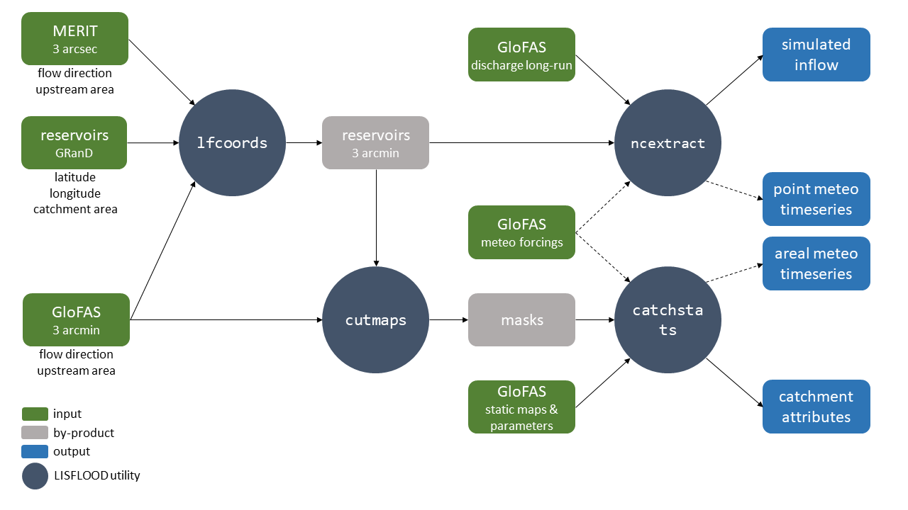

# ResOpsUS: dataset

This folder contains all the notebooks used to create the dataset of reservoir operations in the US. It uses four sources of information:

* The original [ResOpsUS](https://www.nature.com/articles/s41597-022-01134-7) dataset, that includes records for 679 major reservoirs across the US. The time series include inflow, storage, outflow and evaporation, although not all variables are available for all reservoirs.
* The reservoir characteristics (storage capacity, surface area, catchment area, use...) from the Global Reservoir and Dam dataBase ([GRanD](https://www.globaldamwatch.org/grand/)).
* The static maps, model parameter, forcings, and long-term run from [GloFASv4](https://global-flood.emergency.copernicus.eu/).
* The flow direction and upstream area maps from [MERIT](https://hydro.iis.u-tokyo.ac.jp/~yamadai/MERIT_DEM/).

## Preprocessing

Several [lisflood-utilities](https://github.com/ec-jrc/lisflood-utilities) are used to preprocess the GloFAS data that will be used to build the dataset. The flowchart below shows the whole process.



***Figure 1**. Preprocessing of GloFAS data.*

The steps are the following:

1. Find the reservoir location in the GloFAS grid using the [`lfcoords`](https://github.com/ec-jrc/lisflood-utilities/wiki/lfcoords) tool.
2. Use the [`cutmaps`](https://github.com/ec-jrc/lisflood-utilities/wiki/cutmaps) tool to derive the catchment masks.
3. Run the [`catchstats`](github.com/ec-jrc/lisflood-utilities/wiki/catchstats) tool generate catchment aggregations:
    * Areal meteorological time series from the GloFAS forcings.
    * Catchment characteristics from the GloFAS static maps.
4. Run the [`ncextract`](github.com/ec-jrc/lisflood-utilities/wiki/ncextract) tool to extract time series from the exact location of the reservoir:
    * Simulated inflow from the GloFAS long-term run.
    * Meteorological time series in the reservoir from the GloFAS forcings. 

## Create the dataset

### Configuration file

All the notebooks in this folder are configured by a YML file that defines the location of the input data, the study period, the conditions that a reservoir need to fulfil to be selected for the model calibration, etc.

```YML
version: # version of the dataset

paths:
    LISFLOOD: 
        root: /home/user/GloFASv4 # directory that contains the GloFAS data
        timeseries: # subdirectory with the long-term run
    GRanD: /home/user/GRanD/v1_3 # directory that contains the GRanD shapefiles
    ResOps: 
        root: /home/user/ResOpsUS # directory where the ResOpsUS original dataset is saved
        obs_timeseries: raw/time_series_all # subdirectory with the observed time series
        sim_timeseries: ancillary/LISFLOOD # subdirectory with the simulated time series

normalize: True # normalize time series by reservoir storage capacity

period:
    start: 1982-01-01
    end:

conditions:
    min_area: 50 # km²
    min_volume: 10 # hm3
    min_dor: 0.08 # degree of regulation
    min_dod: 0.06 # degree of disruptivity
    min_years: 4 # years, minimum length of the time series
    tol_bias: 0.3 # relative bias accepted between inflow and outflow
```

### Static attributes

The first three notebooks are dedicated to generate the static attributes.

[1.1_attributes_grand.ipynb](1.1_attributes_grand.ipynb) creates three CSV files with the reservoir attributes from the original ResOpsUS dataset (_resops.csv_), GRanD (_grand.csv_) and GloFAS (_glofas.csv_). From the GRanD information, it will export the CSV file with coordinates and catchment area that is the input of the `lfcoords` tool at the beginning of the pre-processing.

[1.2_attributes_from_static_maps.ipynb](1.2_attributes_from_static_maps.ipynb) computes catchment characteristics using the GloFAS static maps, GloFAS model parameters and the masks resulting from running the tool `cutmaps`. The result are two CSV file called _glofas_static_maps.csv_ and _glofas_model_parameters.csv_.

[1.3_attributes_meteo.ipynb](1.3_attributes_meteo.ipynb) reads the meteorological time series resulting from running `catchstats` on the GloFAS forcings, and it computes climate indices. The result is a CSV file called _climate_indices.csv_.

### Time series

The notebook [2_time_series.ipynb](2_time_series.ipynb) reads all the available time series, processes them (clean, trim, normalize) and produces the CSV and NetCDF files for each reservoir.

### Select reservoirs and calibration period

The notebook [3_select_reservoirs_periods.ipynb](3_select_reservoirs_periods.ipynb) reads the static attributes and time series produced in the previous notebooks and creates a TXT with the selection of reservoirs and a Pickle file with the time period where data is available for calibration. This selection of reservoirs and calibration period is based on the conditions defined in the [configuration file](#Configuration-file).

